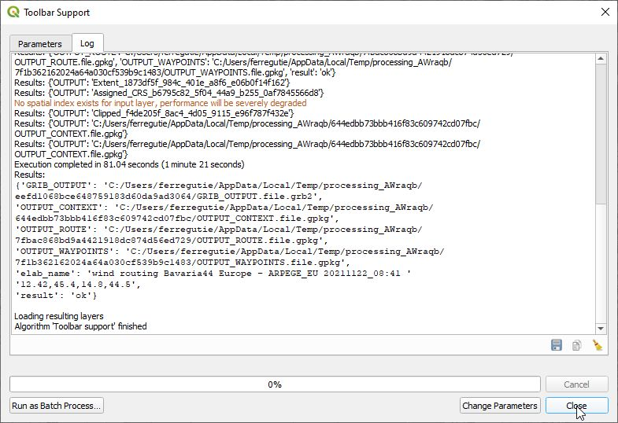

# Wind forecast routing

## Credits

The plugin is based on [libweatherrouting routing library](https://github.com/dakk/libweatherrouting/) ©2021 Davide Gessa, Riccardo Apolloni, Enrico Ferreguti

The grib models are provided by https://opengribs.org

The polar files are provided by https://www.seapilot.com

## For newbies

* install QGIS following instructions in https://www.qgis.org/en/site/forusers/download.html
* optionally load your map or a base map from ``QGIS>Browser>XYZ Tiles>OpenStreetMap``
* zoom to your area of interest
* Install the plugin from ``Plugins > Manage and install plugins`` menu; search for it and click on ``Install``.

## The plugin itself

- The plugin will be shown under ``Plugins`` menu: ``Wind forecast routing`` and in toolbar with the icon 

- Launch the plugin clicking on icon or menu item

- Choose a boat [polar](https://www.seapilot.com/features/polars/)

- Specify Start and End track points

- Specify a time of departure or leave the proposed one (now time)

- Optionally specify the wind model or leave the auto choice (the plugin will download the more accurate wind grib files for the specified track location)

- optionally specify grib, waypoints and route files location (otherwise the plugin will place the files in system temporary directory)

- check **Animate route with temporal controller at the end of algorithm processing** control whether temporal capabilities should be activated to improve results visualization

- Perform routing with ``Run``. The plugin will download the wind model chosen for the area of interest, and will calculate the fastest route.

- At the and of calculation press  ``Close`` and Enjoy results.

  |  |  |
  | ------------------------ | ------------------------ |
  |                          |                          |

Please keep in mind that:

* currently the plugin uses a rough coastline (natural earth `ne_10m_ocean`, you can find it in the plugin source directory), avoid tracks crossing complex geographical context to prevent issues in algorithm calculation due to lack of solutions within the temporal or geographical scope of grib model
* Furthermore avoid too far start and end points. Tracks longer than 300 - 400 nautical miles could bring algorithm outside downloaded grib scope and cause processing exceptions.
* Even too short tracks, closer than 20-30 nautical miles, could cause algorithm exception.
* the output layers are set up for temporal display. Check the Temporal panel settings for correct time/location visualization.

Please report any issue on the [bugtracker](https://github.com/enricofer/wind_forecast_routing/issues).

